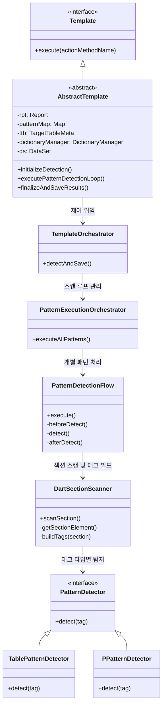
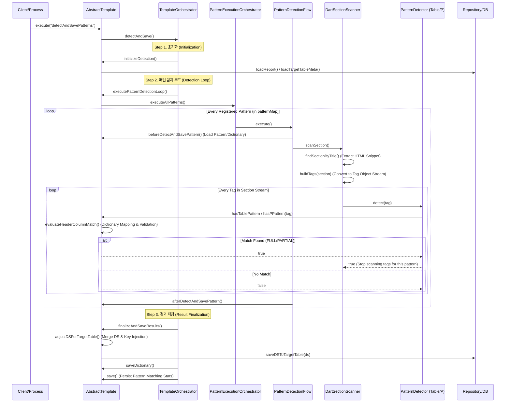

---
{"dg-publish":true,"permalink":"/04-projects/01-dart/03-tech-stack/dart-spec/","tags":["gardenEntry"]}
---

# DART 분석 엔진 기술 명세서 (Technical Specifications)

DART 분석 엔진은 공시 보고서(HTML/XML) 내에서 정의된 패턴(표, 문단)을 탐지하고, 용어 사전을 활용하여 데이터를 정형화된 데이터베이스 형태로 추출하는 프레임워크입니다.

## 1. 개요 (Overview)
본 명세서는 DART 공시문서 분석 엔진의 `execute()` 메서드 호출 이후 발생하는 내부 로직, 객체 간의 상호작용 및 데이터 흐름을 상세히 기술합니다.

## 2. 주요 클래스 다이어그램 (Class Diagram)

분석 엔진은 **Orchestration**, **Detection**, **Data Model**, **Utility** 레이어로 구성되어 관심사를 분리합니다.

## 3. 시퀀스 다이어그램 (Sequence Diagram)

`execute("detectAndSavePatterns")` 호출 시점부터의 데이터 처리 흐름입니다.

## 4. 로직 상세 명세 (Logic Specifications)

### 4.1. Orchestration 레이어
- **`TemplateOrchestrator`**: 시스템의 최상위 제어기로서 초기화, 탐지 시퀀스 실행, 결과 저장을 원자적으로 실행합니다.
- **`PatternExecutionOrchestrator`**: `patternMap`에 정의된 우선순위에 따라 패턴을 순회하며, 탐지 전략(탐지 시 중단 여부 등)을 결정합니다.

### 4.2. Detection 레이어 (탐출 엔진)
- **`DartSectionScanner`**:
    - `DartDataExtractor`를 활용하여 문서 전체에서 분석에 불필요한 노드를 제거하고 타겟 섹션을 격리합니다.
    - HTML 요소를 `Tag` 객체(Table, P)로 맵핑하여 스트림 형태로 공급합니다.
    - `ChapterExtractor`를 통해 현재 스캔 중인 맥락(Context)인 대제목(Major Title) 정보를 유지합니다.
- **`PatternDetector` 및 `Evaluator`**:
    - **Dictionary Mapping**: 추출된 헤더 텍스트를 용어 사전을 통해 표준 `colId`로 치환합니다.
    - **Coverage Analysis**: 치환된 `colId`들이 목표 테이블 스키마의 필수 컬럼(`required = true`)을 모두 만족하는지 판별합니다.

### 4.3. Data & Storage 레이어
- **`TargetTableMeta`**: DB 메타데이터를 기반으로 Staging 테이블 구조를 관리하며, `isTemporary` 속성을 가진 컬럼은 매칭 검증용으로만 사용하고 최종 저장 시 제외합니다.
- **`DataSet Adjustment`**: 
    - 탐지된 데이터를 병합(Merge)합니다.
    - `CORP_CODE`, `SA_YM` 등 공시 보고서의 공통 키를 주입합니다.
    - `SEQ_NO`를 생성하여 데이터의 순서를 보장합니다.

## 5. 인프라 및 유틸리티
- **`Repository`**: 파일 및 데이터베이스로의 지속성(Persistence)을 담당하며, `SaveModePolicy`에 따라 저장 매체를 선택합니다.
- **`DictionaryManager`**: 전역 계정 사전 및 패턴별 사전을 관리하며, 사용자가 직접 수동 매핑한 `UserDictionary` 우선순위를 처리합니다.

---
*본 문서는 DART 분석 엔진의 소스코드 분석을 통해 자동으로 생성된 기술 명세입니다.*
